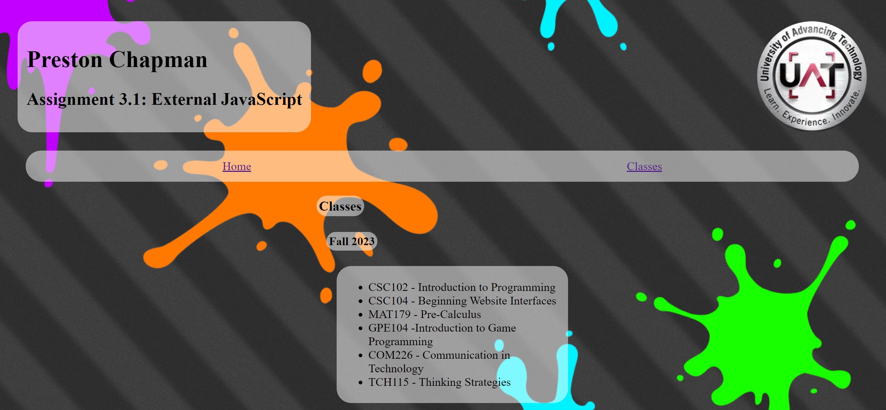

# CSC256 3.1
## Information

This assignment can be viewed at [pchapman-uat.github.io/CSC256-3.1](https://pchapman-uat.github.io/CSC256-3.1/index.html)

## Assignment Description
The activity is an introduction to the JavaScript Web scripting language with a coding exercise. You will create an external JavaScript file to be referenced and displayed by another html page.

## Screenshots

